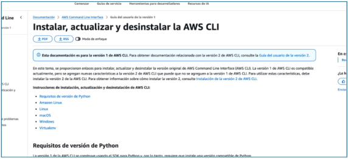
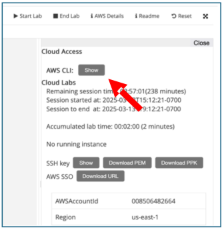

## INSTALANDO AWS CLI 

AWS CLI, es el cliente de AWS mediante el cual podremos utilizar la terminal para poder trabajar con nuestro entorno en lugar de utilizar la herramienta gráfica. 

En este apartado indicaré la página de la documentación desde donde podremos ir siguiendo las instrucciones de instalación: 

[https://docs.aws.amazon.com/es_es/cli/latest/userguide/getting-started-install.html ](https://docs.aws.amazon.com/es_es/cli/latest/userguide/getting-started-install.html)

Desde aquí podremos seleccionar el sistema operativo en el que trabajamos y poder seguir las instrucciones de instalación. 

Una vez finalizada la instalación podremos comprobar la versión instalada. 

## EL LABORATORIO 

Bien, ya tenemos un laboratorio en marcha y el cliente instalado, el siguiente paso es conectarlos, para ello hay que seguir los siguientes pasos: 

Ver credenciales del laboratorio: 

Haremos click en show: 

Ahora utilizaremos el siguiente comando para enlazar la terminal con el lab. 

``aws configure``  

E iremos copiando y pegando la información que nos vaya pidiendo: 

Una vez configurado comprobaremos si podemos recuperar la información del usuario: 

``aws sts get-caller-identity``

En el caso de los labs vemos que no logra conectarse y devuelve un error. Para paliar este error accederemos a la carpeta personal del usuario y dentro de ésta hay una carpeta oculta .aws (creada cuando hemos hecho aws configure), y dentro de esta carpeta tenemos el archivo credentials, el cual tiene la información que hemos introducido antes. Ahora bien, para arreglarlo vaciaremos el contenido del archivo y copiaremos toda la información de AWS Details dentro del archivo: 

Y una vez hecho comprobaremos si nos devuelve las credenciales: 

Al ser un entorno preparado de laboratorio las credenciales devueltas son de un perfil general  (Estudiante  de  prueba)  pero  si  fueran  credenciales  reales  devolvería  el  nombre correspondiente. Destacar que Arn significa Amazon Resource Name que es el identificador que genera AWS para identificar recursos/servicios. 
